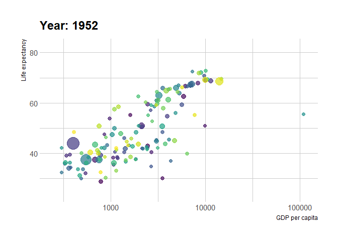

```{r setup, include=FALSE}
rm(list=ls())
knitr::opts_chunk$set(echo = TRUE)
options(scipen=999)

```

# Load packages

```{r packages}
pacman::p_load(ggplot2, ggExtra, gganimate, ggcorrplot, extrafont, tidyverse, tidySEM, dplyr, 
               UpSetR, plyr, gapminder, plotly, janitor, ggbreak, lavaan, patchwork, install = TRUE)

```

I have been collecting some useful resources for data visualization in R.
Below are a few top selections from my exploration.

# Correlation using correlogram
You could move beyond corration tables and have simple yet informative plots using `ggcorrplot`.

```{r, ggcorrplot,  dpi=300}
data(mtcars)
correl <- round(cor(mtcars), 2)

ggcorrplot(correl, hc.order = TRUE, 
           type = "upper", 
           lab = TRUE, 
           lab_size = 3, 
           method="square",
           colors = c("#B95C50",  "#FFFFFF", "#5B7586"), 
           title="Correlogram of mtcars", 
           # ggtheme=theme_light
           # ggtheme=hrbrthemes::theme_ipsum()
           )

```

## <a href="https://github.com/hms-dbmi/UpSetR" target="_blank">UpsetR</a> plots
Ever wanted to substitute your overcrowded venn diagrams with something more fancy? Well, there is an option for you in `UpsetR` plots. Other than the clean look of these plots, they also allow for additional metadata to be visualised alongside the intersections/shared variables in a dataset.

```{r, upsetR, dpi=300, warning=FALSE}
movies <- read.csv(system.file("extdata", "movies.csv", package = "UpSetR"),
                   header = T, sep = ";")


upset(movies, main.bar.color = "black",
      queries = list(list(query = intersects,
                          params = list("Drama"),
                          active = T)),
      attribute.plots = list(gridrows = 50,
                             plots = list(list(plot = histogram,
                                               x = "ReleaseDate", queries = F),
                                          list(plot = histogram,
                                               x = "AvgRating", queries = T)),
                             ncols = 2))

upset(movies,
      main.bar.color = "black",
      queries = list(list(query = intersects,
                          params = list("Drama"),
                          color = "red", active = F),
                     list(query = intersects,
                          params = list("Action", "Drama"), active = T),
                     list(query = intersects,
                          params = list("Drama", "Comedy", "Action"),
                          color = "orange", active = T)),
      attribute.plots = list(gridrows = 45,
                             plots = list(list(plot = scatter_plot,
                                               x = "ReleaseDate",
                                               y = "AvgRating",
                                               queries = T),
                                          list(plot = scatter_plot,
                                               x = "AvgRating",
                                               y = "Watches",
                                               queries = F)),
                             ncols = 2),
      query.legend = "bottom")


myplot <- function(mydata, x, y) {
   plot <- (ggplot(data = mydata, aes_string(x = x, y = y, colour = "color")) +
               geom_point() +
               scale_color_identity() +
               theme(plot.margin = unit(c(0, 0, 0, 0), "cm")))
}

another.plot <- function(data, x, y) {
   data$decades <- round_any(as.integer(unlist(data[y])), 10, ceiling)
   data <- data[which(data$decades >= 1970), ]
   myplot <- (ggplot(data, aes_string(x = x)) +
                 geom_density(aes(fill = factor(decades)),
                              alpha = 0.4) +
                 theme(plot.margin = unit(c(0, 0, 0, 0), "cm"),
                       legend.key.size = unit(0.4, "cm")))
}

# Example of applying the myplot custom attribute plot defined above to the data.

upset(movies, main.bar.color = "black",
      queries = list(list(query = intersects,
                          params = list("Drama"),
                          color = "red",
                          active = F),
                     list(query = intersects,
                          params = list("Action", "Drama"),
                          active = T),
                     list(query = intersects,
                          params = list("Drama", "Comedy", "Action"),
                          color = "orange",
                          active = T)),
      attribute.plots = list(gridrows = 45,
                             plots = list(list(plot = myplot,
                                               x = "ReleaseDate",
                                               y = "AvgRating",
                                               queries = T),
                                          list(plot = another.plot,
                                               x = "AvgRating",
                                               y = "ReleaseDate",
                                               queries = F)),
                             ncols = 2))

```

# Breathing some life into plots 

## <a href="https://plotly.com/r/" target="_blank">Plotly</a> visualizations for `shiny` and web applications

Web-based interactive charting is gaining popularity and no other package IMO does a better job like `plotly`. With this beast, you can plot beyond the `ggplot2` API capabilities

```{r, Plotly, dpi=300, warning=FALSE, fig.height=2.5, fig.width=3}
g <- ggplot(faithful, aes(x = eruptions, y = waiting)) +
stat_density_2d(aes(fill = ..level..), geom = "polygon") +
xlim(1, 6) + ylim(40, 100)

gg <- ggplotly(g, dynamicTicks = "y")
style(gg, hoveron = "points", hoverinfo = "x+y+text", hoverlabel = list(bgcolor = "white"))

```


```{r, plot_ly, dpi=300, warning=FALSE, fig.height=2.5, fig.width=3}
gapminder %>%
   plot_ly(
      x = ~gdpPercap,
      y = ~lifeExp,
      size = ~pop,
      color = ~continent,
      frame = ~year,
      text = ~country,
      hoverinfo = "text",
      type = 'scatter',
      mode = 'markers'
   ) %>%
   layout(
      xaxis = list(
         type = "log"
      )
   )

```

## Gganimate allows for transition through distinct variables

Like `plotly`, `gganimate` allows for automated animation of `ggplot2`-like graphics. See more examples <a href="https://www.datanovia.com/en/blog/gganimate-how-to-create-plots-with-beautiful-animation-in-r/" target="_blank">here</a>

Starting with a generic `ggplot2` plot:

```{r, ggplot, dpi=300, warning=FALSE}
(p <- ggplot(
  gapminder, 
  aes(x = gdpPercap, y=lifeExp, size = pop, colour = country)
  ) +
  geom_point(show.legend = FALSE, alpha = 0.7) +
  scale_color_viridis_d() +
  scale_size(range = c(2, 12)) +
  scale_x_log10() +
  labs(x = "GDP per capita", y = "Life expectancy") +
  hrbrthemes::theme_ipsum())

```

We can add some animation to teh plot. Since `RMarkdown` isn't going to render the animation, we first need to save a `GIF` which can then be rendered outside the chunk

```{r, gganimate, dpi=300, fig.height=7, fig.width=7,warning=FALSE, results = FALSE}
p1 <- p + transition_time(year) +
  labs(title = "Year: {frame_time}")
anim_save("p1.gif", p1)

```



# Population Pyramids and Diverging Lollipop Charts
You could read about the nuts and bolts of this fun plot <a href="http://r-statistics.co/Top50-Ggplot2-Visualizations-MasterList-R-Code.html#1.%20Correlation" target="_blank">here</a> 

```{r, pyramid, dpi=300}
email_campaign_funnel <- read.csv("https://raw.githubusercontent.com/selva86/datasets/master/email_campaign_funnel.csv")
brks <- seq(-15000000, 15000000, 5000000)
lbls = paste0(as.character(c(seq(15, 0, -5), seq(5, 15, 5))), "m")

# Plot
ggplot(email_campaign_funnel, aes(x = Stage, y = Users, fill = Gender)) +   # Fill column
                              geom_bar(stat = "identity", width = .6) +   # draw the bars
                              scale_y_continuous(breaks = brks,   # Breaks
                                                 labels = lbls) + # Labels
                              coord_flip() +  # Flip axes
                              labs(title="Email Campaign Funnel") +
                              ggthemes::theme_excel_new() + 
                              # hrbrthemes::theme_ipsum() +
                              theme(plot.title = element_text(hjust = .5), 
                                    axis.ticks = element_blank()) +   # Centre plot title
                              scale_fill_manual(values = c("#B95C50", "#5B7586"))
```


```{r, lollipop, dpi=300, fig.height=6, fig.width=3}
# Data Prep
data("mtcars")  # load data
mtcars$`car name` <- rownames(mtcars)  # create new column for car names
mtcars$mpg_z <- round((mtcars$mpg - mean(mtcars$mpg))/sd(mtcars$mpg), 2)  # compute normalized mpg
mtcars$mpg_type <- ifelse(mtcars$mpg_z < 0, "below", "above")  # above / below avg flag
mtcars <- mtcars[order(mtcars$mpg_z), ]  # sort
mtcars$`car name` <- factor(mtcars$`car name`, levels = mtcars$`car name`)  # convert to factor to retain sorted order in plot.

ggplot(mtcars, aes(x=`car name`, y=mpg_z, label=mpg_z)) + 
  geom_point(stat='identity', fill="black", size=6)  +
  geom_segment(aes(y = 0, 
                   x = `car name`, 
                   yend = mpg_z, 
                   xend = `car name`), 
               color = "black") +
  geom_text(color="white", size=2) +
  labs(title="Diverging Lollipop Chart", 
       subtitle="Normalized mileage from 'mtcars': Lollipop") + 
  ylim(-2.5, 2.5) +
  coord_flip()

```

# Structural Equation Modeling (SEM) and Confirmatory Factor Analysis (CFA)

Some very smart humans have talked in detail about `SEM` and `CFA` <a href="https://stats.oarc.ucla.edu/r/seminars/rsem/" target="_blank">here</a>. `SEM` technique is the __combination__ of __factor analysis__ and __multiple regression analysis__, and it is used to analyze the structural relationship between __measured variables__ and __latent constructs__. `CFA` on the other hand borrows many of  the same concepts from `SEM` and `exploratory factor analysis`. However, instead of letting the data tell us the factor structure, we apply pre-determineed factor structure and verify the psychometric structure of a previously developed scale. This of it as a particular case of SEM for model evaluation. It is a process which consists in specifying quantity and kinds of observed variables to one or more latent variables and analyze how well those variables measure the latent variable itself. Think of a latent variable as an artificial variable that is represented as a linear combination of observed variables.

You've fit structural equations in observed variable models and latent variables, how do you best present this data? SEM tables look horrible and unreadable by the way!

Enter the SEM graphs.. 

```{r, lavaan, dpi = 300}
HS.model <- ' visual  =~ x1 + x2 + x3
              textual =~ x4 + x5 + x6
              speed   =~ x7 + x8 + x9 '
fit <- cfa(HS.model, data=HolzingerSwineford1939)
graph_sem(model = fit)

lay <- get_layout("", "", "visual","","textual","","speed","", "",
                  "x1", "x2", "x3", "x4", "x5", "x6", "x7", "x8", "x9", rows = 2)

graph_sem(fit, layout = lay)

semPlot::semPaths(fit, "std", curvePivot = TRUE, intercepts = TRUE, intStyle = "multi")

```

# Patchwork over grid
`Patchwork` makes alignment of `ggplot2` objects seamless. You should try it sometime..


```{r, patchwork}
iris1 <- ggplot(iris, aes(x = Species, y = Sepal.Length)) +
  geom_boxplot()

iris2 <- ggplot(iris, aes(x = Sepal.Length, fill = Species)) +
  geom_density(alpha = 0.7) +
  theme(legend.position = c(0.8, 0.8))

p1 <- ggplot(mtcars) + geom_point(aes(mpg, disp))
p2 <- ggplot(mtcars) + geom_boxplot(aes(gear, disp, group = gear))

x <- rnorm(100)
eps <- rnorm(100,0,.2)
p3 <- qplot(x,3*x+eps)

```

### Side by Side? use "|" or "+"
```{r, patchwork1}
(iris1|iris2)

iris1+iris2

```

### Stack? use "/"

```{r, patchwork2}
(iris1/iris2)

```

### Grouped
```{r, patchwork3}
(iris1|iris2)/p1/(p2|p3)

```

### Annotate (generic)
```{r, patchwork4}
(iris1|iris2)/p1/(p2|p3) + 
  plot_annotation(tag_levels = 'A')

```

### Annotate (multilevel)

```{r}
(iris1|iris2)/(p1+p2+p3+ plot_layout(tag_level = 'new')) +
  plot_annotation(tag_levels = c('A',"1"))

```


I have used SEM and CFA in some <a href="https://elifesciences.org/articles/58407" target="_blank">published</a> real-life data < href="https://raw.githubusercontent.com/fmobegi/TSI-Data-Analysis/master/TSI_data_analysis.html" target="_blank">before</a>.


# Session Information
All package versions used in this run are listed below.

```{r}
sessionInfo()

```

This script was last updated on:

```{r echo=FALSE}
cat(as.character(paste0(format(Sys.time(), "%a %d %B %Y, %H:%M:%S, %Z")," (",Sys.timezone(location = TRUE),")")))

```

................... THE END ......................

<span style="color:DarkBlue; font-size:9px;">
  By: <a href="https://www.linkedin.com/in/fmobegi/" target="_blank">Dr Fredrick M. Mobegi (BSc: Hons, MSc, PhD)</a><br/>
  Created: 24-08-2022 Wed 12:13<br/>
  Copyright &copy; 2022 | Fredrick Mobegi; PathWest Laboratory Medicine WA | This notebook is for research reference purposes only and it may contains links to embargoed or legally privileged data. Except as permitted by the copyright law applicable to you, you may not reproduce or communicate any of the content on this page, including files downloadable from this page, without written permission of the copyright owner(s).
</span>
